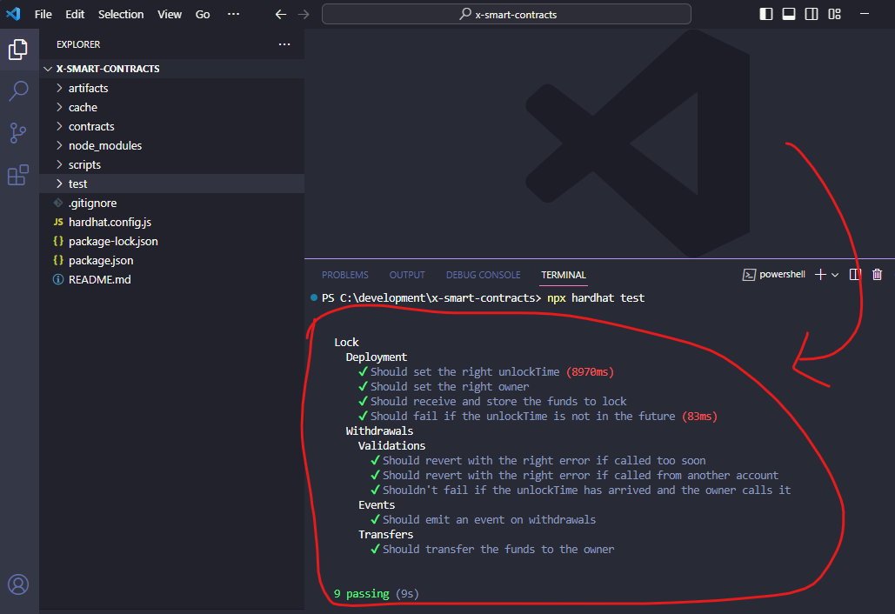

## O que é Solidity?

[Solidity](https://soliditylang.org/) é a linguagem de programação que vamos escrever contratos inteligentes. 

Um contrato inteligente é um acordo automático que garantem que as coisas vão acontecer conforme o planejado, e tudo isso ficará registrado na blockchain.

Para quem já é desenvolvedor, um contrato inteligente é como se fosse uma API e a blockchain é como se fosse a cloud. Então nós vamos escrever os contratos inteligentes com solidity, compilar eles e fazer o deploy em alguma blockchain.

Você vai perceber que durante o curso vou ensinar a rodar uma blockchain na sua máquina local e testar seus contratos inteligentes lá, mas também vou ensinar a fazer o deploy dos contratos inteligentes numa blockchain "real". Eu coloquei "real" entre aspas porque, mesmo que a blockchain seja real, vai ser uma testnet, ou seja, faremos os testes nessa blockchain utilizando tokens (ou criptomoedas) de teste.

## O que é Hardhat?

[Hardhat](https://hardhat.org/) é um framework que cria um ambiente de desenvolvimento Solidity com javascript, isso significa que a gente vai escrever os contratos inteligentes com Solidity normal, mas toda vez que a gente quiser testar, usaremos a linguagem javascript e o ambiente Node para rodar as blockchains e testar os contratos inteligentes.

> Se você não gosta de javascript ou quer tentar algo diferente, sugerimos que use o [Foundry](https://github.com/foundry-rs/foundry), ele é semelhante ao Hardhat mas em vez de usar javascript ele usa Rust.

## Vamos começar!

Primeiro você vai criar uma pasta chamada `x-smart-contracts` e vai abrir ela no vscode.

Agora você vai abrir o terminal e digitar o comando `npm install --save-dev hardhat` para instalar o hardhat no seu computador.

Depois disso, você vai iniciar um projeto hardhat do zero com o comando `npx hardhat` e vai apertar `enter` em todas as perguntas que aparecer. Agora você vai rodar o seguinte comando para instalar as dependências necessárias para rodar o projeto:

```bash
npm install --save-dev hardhat @nomicfoundation/hardhat-toolbox
```

Agora é só rodar os comandos `npx hardhat compile` para compilar os contratos inteligentes do projeto gerado automaticamente e depois `npx hardhat test` para rodar os testes que também foram gerados automaticamente. 

Após fazer todas essas etapas, seu terminal do VSCode deve aparecer isso:




